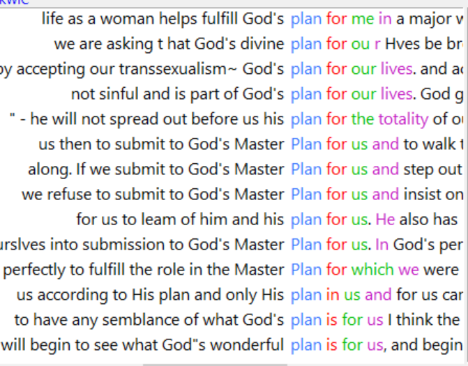
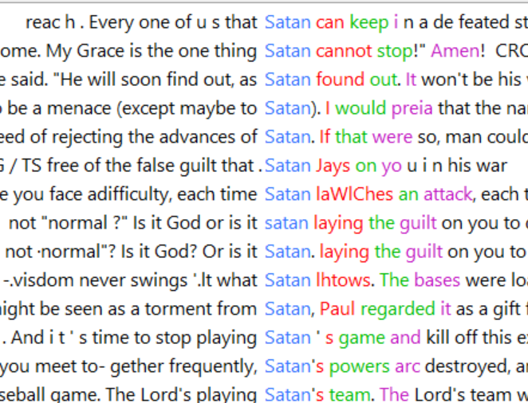

# AntConc
While looking through Voyant's various features a few words jumped out at me that I wanted to explore further using AntConc. One was "plan", as in "God's plan". Sure enough, most of the phrases containing plan refer to "God's plan for us" or an equivalent. 

I noticed a mention of the devil, so I wondered if "satan" or "devil" would come up with such repetitive results. Interestingly, there didn't seem to be any sort of common phrase to go along with Satan.

I also searched for the most common clusters with the word "the". There were the obvious ones like "the lord" and "the church" but the most frequent phrase that stuck out to me was "the enemy". I feel like this probably has a specific Christian meaning that I'm not aware of but I think this phrase would be something to research further. If it is just another word for Satan it would give more options for analyzing how devil-related words are used (there are much fewer examples to look at compared to God-related words). 

Another "the" phrase that I found interesting was "the first". However, I discovered that many of its uses were more logistical, referring to things like "The first issue of Grace and Lace". 

Finally, one last "the" phrase that struck me was "the gender". Of course it would make sense that gender was mentioned a lot in these papers, but why *the* gender? As if there's only one gender? But I then realized that most of these phrases were actually pointing to "the gender *community*" which, after reading through a lot from the Digital Transgender Archive, I've come to realize is essentially what we'd refer to today as the trans community or the gender non-conforming community. 
